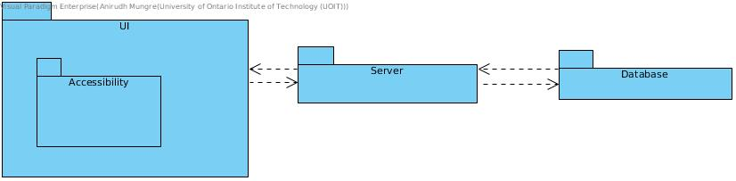

# Iteration 1

## Step 1

The inputs have been reviewed upon creation

## Step 2

### Drivers

#### Use Cases

- UC-7 Student logs into CMS
- UC-8 Be Accessible
- UC-11 Store backups of the CMS on the server

#### Quality Attributes

- QA-4 Security
- QA-5 Security

#### Constraints

- CON-1
- CON-3
- CON-4
- CON-5
- CON-6

## Step 3

### Elements to Refine

Since this is the first iteration, the goal is to create a strong baseline for the rest of the project, including security, priviledge and storage systems. A working back-front end integration working. Alongside a working login system that manages user access and priviledge levels.

## Step 4/5

Design Decisions and Locations|Rationale
---|---
Web App| This way users wont need to download anything
Three tier architecture| Server, client and database
Database Focus| Build strong base database to support app
Security| login for users with different priviledges
Accessibility| Make sure app is usable by ALL levels of user
MVC architecture| MVC to support socket designs

## Step 6

Element| Responsibilities
---|---
Database| Responsible for storage of information
UI| Responsible for user experience and interaction
Accessibility| Part of UI for users in need of accessibility options
Server| Hosts the UI

## Step 7

Please view kanban for Iteration 1.