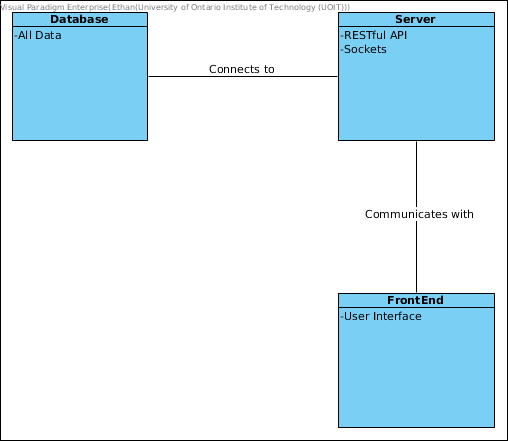

# Iteration 2

The goal of the second iteration, is to decide on the units of implementation, those which affect interfaces, and the way in which development tasks may be distributed and implemented.

## Step 2

### Establish Iteration Goal by Selecting Drivers

In this iteration our goal is to begin to setup the primary functionality of the CMS. We will address the general architecture concern of identifying structures which will provide the primary functionality of the CMS. In this Iteration, we will consider the following use cases and constraints:

#### Use Cases

- UC-1
- UC-2
- UC-3
- UC-4
- UC-5
- UC-9
- UC-10

#### Constraints

- CON-6
- CON-5
- CON-4
- CON-3
- CON-1

## Step 3

### Choose One or More Elements of the System to Refine

In order to refine the primary functionality of the CMS, we must look at the modules located in the different layers defined by iteration 1: The Database, the API, and the UI.

## Step 4

### Choose One or More Design Concepts That Satisfy the Selected Drivers

 Design Decisions and Location | Rationale and Assumptions 
---|---
MongoDB|We are using MONGODB as our DBMS for this system because we are using a full-stack JavaScript application with the MEVN stack
ExpressJS|We will use ExpressJS to build the endpoints for the API, it is a simple yet robust and efficient non-blocking system for building endpoints. It is also a part of the MEVN stack
Digital Ocean|We are using Digital Ocean as the hosting for the VPS, since they have many server locations across the world, as well as automatic memory allocation alterations so that you can scale the system
NGINX|We are going to use NGINX on the server as the reverse proxy, since it has automatic load balancing
SocketIO|We will use SocketIO to allow communication between the server and front-end for large operations or for implimenting the MVC rather than use webhooks
VueJS|We will use VueJS as the front-end framework to build a modern and responsive application with a functional front-end
Material Design|We will use Material Design standard from Google to develop a friendly, relatable interface that provides already implimented accesibility features

## Step 5

### Instantiate Architectual Element, Allocate Responsibilities, and Define Interfaces

Design Decisions and Location | Rationale
---|---
REST API|RESTful api for communication with the server, and the DB Server
DataBase|Database to store all related data, including login information, and information related to courses
FrontEnd|Web-based interface to interact with the api and simplify GET/POST/UPDATE/DELETE operations for each course with a GUI

## Step 6

### Sketch views and Record Design Decisions

Initial Domain Model

## Step 7

### Perform Analysis of Current Design and Review Iteration Goal and Achievement of Design Purpose

See Projects for Kanban board
[Here](https://github.com/SOFE3650F18/project-ontechuconnect/projects/3)