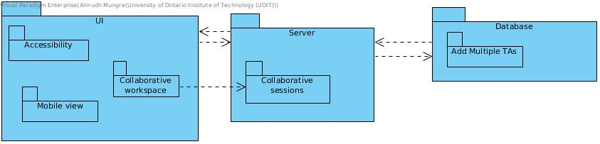

# Iteration 3

## Note

Two people are working on this through live share via VSCode therefore this documents commits is 50% of each students work.

## Step 2

### Establish Iteration Goal by Selecting Drivers

The focus of this iteration is on QA-3, UC-6 and CON-2.  
The focus is to implement a student workspace, allow profs to add as many TA's as possible and implement mobile/portable version of application.

## Step 3

### Choose One or More Elements of the System to Refine

For this scenario the elements that will be refined are the physical nodes that were identified during the first iteration:

- API server
- Database Server
- UI (Mobile Accessibility)

## Step 4

### Choose One or More Design Concepts That Satisfy the Selected Drivers

Design Decisions and Location|Rationale and Assumptions
---|---
Using sockets|To have real time interaction with students on collaborative workspace. Some sort of realtime messaging system
Creating a TA type|In the database creating a TA type which can be assigned to courses and each course can have multiple TA's
Mobile Version|Porting already created web app to mobile friendly version

## Step 5

### Instantiate Architectual Elements, Allocate Responsibilities, and Define Interfaces

Design Decisions and Location|Rationale and Assumptions
---|---
|

## Step 6

### Sketch Views and Record Design Decisions

## Step 7

### Perform Analysis of Current Design and Review Iteration Goal and Achievement of Design Purpose

Drivers completely finished at this point have been set to done on the kanban.  
The current iterations addressed drivers focus on additional functionality as well as a core constraint that would have been costly to implement until this stage of development.